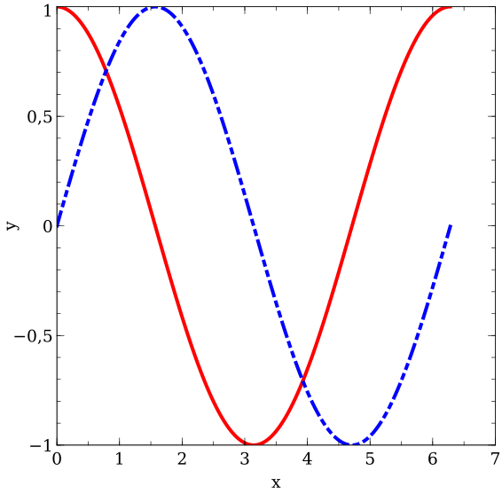

# veusz - Rust Wrapper API for [Veusz](https://veusz.github.io/) 

This crate provides a Rust API for the [Veusz command line and embedding interface (API)](https://veusz.github.io/docs/manual/api.html).
Not all commands are implemented yet, but enough for simple plots like the following (see the [examples](https://github.com/itdesigners/veusz-rs/tree/master/examples)):

This crate might or might not be developed further as the need for more API calls arise.
That said, (small!) pull-requests are welcome. 
